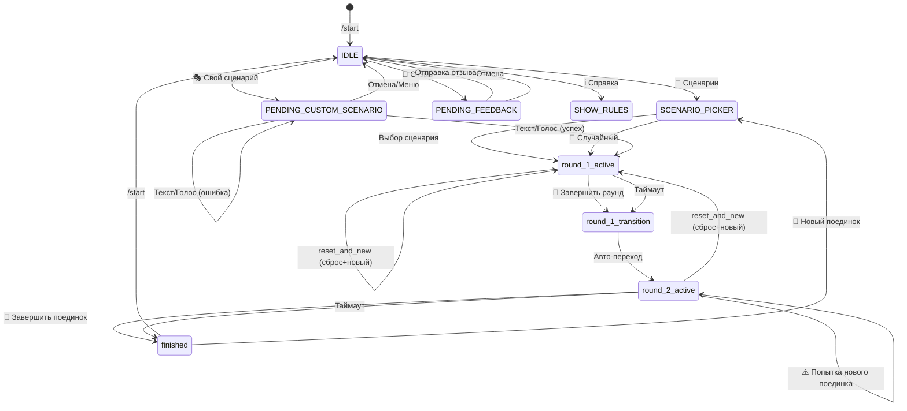
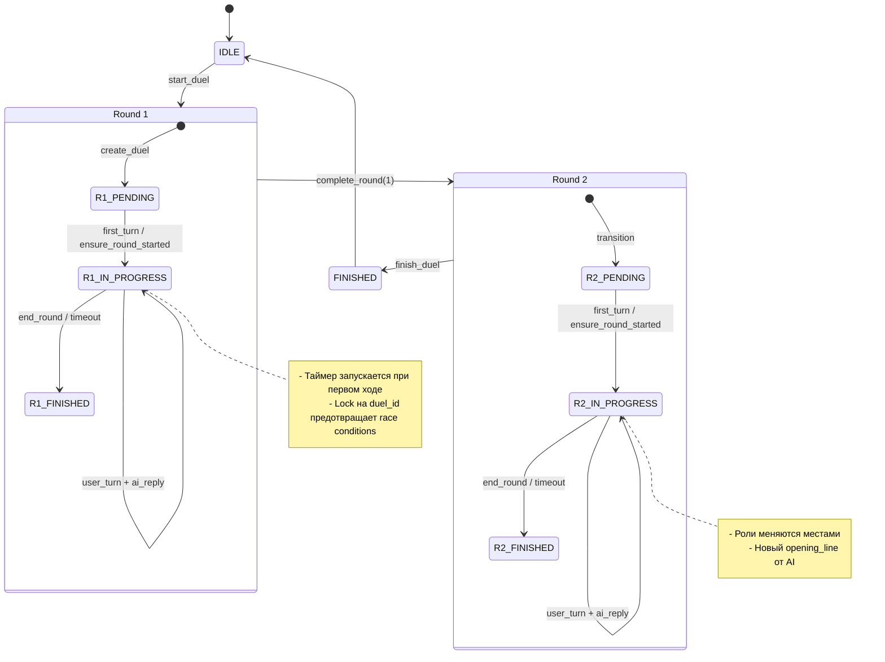

# State Machine Diagram - Agon Arena Bot

## 1. Список состояний (States)

### Глобальные состояния пользователя
| Состояние | Описание |
|-----------|----------|
| `IDLE` | Пользователь без активного поединка |
| `PENDING_CUSTOM_SCENARIO` | Ожидание описания пользовательского сценария |
| `PENDING_FEEDBACK` | Ожидание текста обратной связи |

### Состояния поединка (Duel.status)
| Состояние | Описание |
|-----------|----------|
| `draft` | Черновик (не используется активно) |
| `round_1_active` | Первый раунд активен |
| `round_1_processing` | Первый раунд обрабатывается |
| `round_1_transition` | Переход от первого ко второму раунду |
| `round_2_active` | Второй раунд активен |
| `round_2_processing` | Второй раунд обрабатывается |
| `round_2_transition` | Завершение второго раунда |
| `finished` | Поединок завершён |
| `cancelled` | Поединок отменён |
| `judging` | Идёт оценка судей (неявное) |

### Состояния раунда (DuelRound.status)
| Состояние | Описание |
|-----------|----------|
| `pending` | Раунд создан, но не начат |
| `in_progress` | Раунд идёт (есть started_at) |
| `finished` | Раунд завершён (есть finished_at) |

## 2. Список событий (Events)

### Команды и кнопки
| Событие | Источник | Описание |
|---------|----------|----------|
| `/start` | Команда | Показать главное меню |
| `START_BUTTON` | Кнопка | 🎯 Сценарии - выбор сценария |
| `RANDOM_SCENARIO_BUTTON` | Кнопка | 🎲 Случайный - случайный сценарий |
| `CUSTOM_SCENARIO_BUTTON` | Кнопка | 🎭 Свой сценарий - создать свой |
| `END_ROUND_BUTTON` | Кнопка | 🏁 Завершить раунд |
| `RULES_BUTTON` | Кнопка | ℹ️ Справка |
| `FEEDBACK_BUTTON` | Кнопка | 💬 Отзыв |
| `pick_scenario:{id}` | Callback | Выбор конкретного сценария |
| `scenarios_page:{n}` | Callback | Переключение страницы |
| `custom_scenario` | Callback | Запрос пользовательского сценария |
| `end_round` | Callback | Завершить раунд (inline) |
| `duel:v1:end:{id}:{round}` | Callback | Новый формат завершения раунда |
| `continue_duel` | Callback | Продолжить текущий поединок |
| `reset_and_new` | Callback | Сбросить и начать новый |
| `reset_and_start:{id}:{code}` | Callback | Сброс и старт сценария |
| `continue_current:{id}` | Callback | Продолжить текущий |
| `reset_duel:{id}` | Callback | Сбросить поединок |
| `back_to_menu` | Callback | Вернуться в меню |

### Сообщения
| Событие | Источник | Описание |
|---------|----------|----------|
| `TEXT_MESSAGE` | Пользователь | Текстовое сообщение |
| `VOICE_MESSAGE` | Пользователь | Голосовое сообщение |
| `AUDIO_MESSAGE` | Пользователь | Аудио файл |

### Системные события
| Событие | Источник | Описание |
|---------|----------|----------|
| `ROUND_TIMEOUT` | Таймер | Время раунда истекло |
| `DUEL_CREATED` | Система | Поединок успешно создан |
| `TURN_PROCESSED` | Система | Ход обработан |
| `AI_REPLY_GENERATED` | Система | Ответ AI сгенерирован |

## 3. Таблица переходов (State × Event → New State)

### Переходы из IDLE
| Текущее состояние | Событие | Новое состояние | Условие |
|-------------------|---------|-----------------|---------|
| `IDLE` | `/start` | `IDLE` | - |
| `IDLE` | `START_BUTTON` | `SCENARIO_PICKER` | - |
| `IDLE` | `CUSTOM_SCENARIO_BUTTON` | `PENDING_CUSTOM_SCENARIO` | - |
| `IDLE` | `FEEDBACK_BUTTON` | `PENDING_FEEDBACK` | - |
| `IDLE` | `RULES_BUTTON` | `IDLE` | Показать справку |
| `IDLE` | `pick_scenario:{id}` | `round_1_active` | Создан поединок |
| `IDLE` | `pick_scenario:random` | `round_1_active` | Создан поединок |

### Переходы из PENDING_CUSTOM_SCENARIO
| Текущее состояние | Событие | Новое состояние | Условие |
|-------------------|---------|-----------------|---------|
| `PENDING_CUSTOM_SCENARIO` | `TEXT_MESSAGE` | `round_1_active` | Успешный парсинг |
| `PENDING_CUSTOM_SCENARIO` | `VOICE_MESSAGE` | `round_1_active` | Успешный STT + парсинг |
| `PENDING_CUSTOM_SCENARIO` | `AUDIO_MESSAGE` | `round_1_active` | Успешный STT + парсинг |
| `PENDING_CUSTOM_SCENARIO` | `TEXT_MESSAGE` | `PENDING_CUSTOM_SCENARIO` | Ошибка парсинга |
| `PENDING_CUSTOM_SCENARIO` | `START_BUTTON` | `IDLE` | Отмена |

### Переходы внутри поединка (Round 1)
| Текущее состояние | Событие | Новое состояние | Условие |
|-------------------|---------|-----------------|---------|
| `round_1_active` | `TEXT_MESSAGE` | `round_1_active` | Ход обработан |
| `round_1_active` | `VOICE_MESSAGE` | `round_1_active` | STT + ход |
| `round_1_active` | `AUDIO_MESSAGE` | `round_1_active` | STT + ход |
| `round_1_active` | `END_ROUND_BUTTON` | `round_1_transition` | Завершение раунда 1 |
| `round_1_active` | `ROUND_TIMEOUT` | `round_1_transition` | Авто-завершение |
| `round_1_active` | `END_ROUND_BUTTON` | `round_2_active` | Немедленный переход |

### Переходы между раундами
| Текущее состояние | Событие | Новое состояние | Условие |
|-------------------|---------|-----------------|---------|
| `round_1_transition` | (auto) | `round_2_active` | Смена ролей |

### Переходы внутри поединка (Round 2)
| Текущее состояние | Событие | Новое состояние | Условие |
|-------------------|---------|-----------------|---------|
| `round_2_active` | `TEXT_MESSAGE` | `round_2_active` | Ход обработан |
| `round_2_active` | `VOICE_MESSAGE` | `round_2_active` | STT + ход |
| `round_2_active` | `AUDIO_MESSAGE` | `round_2_active` | STT + ход |
| `round_2_active` | `END_ROUND_BUTTON` | `finished` | Завершение + судьи |
| `round_2_active` | `ROUND_TIMEOUT` | `finished` | Авто-завершение + судьи |

### Переходы при активном поединке (глобальные)
| Текущее состояние | Событие | Новое состояние | Условие |
|-------------------|---------|-----------------|---------|
| `round_*_active` | `START_BUTTON` | `round_*_active` | Показать предупреждение |
| `round_*_active` | `reset_and_new` | `IDLE` → `round_1_active` | Сброс + новый |
| `round_*_active` | `reset_and_start:{id}` | `IDLE` → `round_1_active` | Сброс + конкретный |
| `round_*_active` | `continue_current:{id}` | `round_*_active` | Продолжить |

## 4. Диаграмма Mermaid



### Детальная диаграмма с подсостояниями раундов



## 5. Выявленные проблемы в Flow

### 5.1 Race Conditions

#### Проблема: Двойное создание поединка
**Место:** `_start_duel()` в `menu.py`
**Сценарий:**
1. Пользователь быстро дважды нажимает кнопку выбора сценария
2. Два запроса параллельно проходят проверку `get_latest_duel_for_user()`
3. Оба создают поединок

**Решение:** ✅ Реализовано - `duel_lock_manager.acquire_user_lock()` с таймаутом 30 секунд

#### Проблема: Параллельная обработка хода
**Место:** `_run_turn()` в `menu.py`
**Сценарий:**
1. Пользователь отправляет голосовое, пока обрабатывается предыдущее
2. STT может занять время, пользователь отправляет ещё одно
3. Два хода обрабатываются параллельно

**Решение:** ✅ Реализовано - `duel_lock_manager.acquire_duel_lock()` с таймаутом 30 секунд

#### Проблема: Двойное завершение раунда
**Место:** `_process_end_round()` в `menu.py`
**Сценарий:**
1. Пользователь нажимает кнопку завершения раунда
2. Таймер тоже срабатывает на истечение времени
3. Оба пытаются завершить раунд

**Решение:** ✅ Реализовано - `duel_lock_manager.acquire_duel_lock()` + проверка статуса после получения лока

#### Проблема: Проверка активного поединка после STT
**Место:** `process_voice_turn()` в `menu.py`
**Сценарий:**
1. Пользователь отправляет голосовое без активного поединка
2. Начинается STT (может занять секунды)
3. Пользователь быстро начинает новый поединок через меню
4. После STT голосовое обрабатывается как ход в новом поединке (нежелательно)

**Решение:** ⚠️ Частично - есть `_get_active_duel_with_retry()` но проверка происходит ПОСЛЕ STT

### 5.2 Потеря сообщений

#### Проблема: Удаление старых сообщений сценариев
**Место:** `_send_scenario_picker()` в `menu.py`
```python
prev_message_id = _SCENARIO_PICKER_MESSAGE_IDS.pop(user_id, None)
if prev_message_id:
    try:
        await message.bot.delete_message(...)
    except Exception:
        pass
```
**Риск:** Если сообщение старше 48 часов, удаление не сработает - пользователь видит старую клавиатуру

#### Проблема: Callback устаревших сообщений
**Место:** `end_round_v1_callback()` в `menu.py`
**Сценарий:**
1. Пользователь получает сообщение с inline-кнопкой
2. Поединок завершается другим способом (таймер/другая кнопка)
3. Пользователь нажимает старую кнопку
4. Callback пытается работать с несуществующим/завершённым поединком

**Решение:** ✅ Реализована проверка `duel.status` и `duel.user_telegram_id` в callback

#### Проблема: Сообщения вне контекста
**Место:** `process_turn()` в `menu.py`
**Сценарий:**
1. Пользователь в `PENDING_CUSTOM_SCENARIO` состоянии
2. Отправляет сообщение, которое не парсится как сценарий
3. Сообщение "теряется" - нет ясного ответа что делать дальше

**Решение:** ⚠️ Есть сообщение об ошибке, но UX может быть запутанным

### 5.3 Непоследовательность состояний

#### Проблема: Duel.status vs DuelRound.status
**Наблюдение:** Существует двойная система состояний:
- `Duel.status`: `round_1_active`, `round_1_transition`, etc.
- `DuelRound.status`: `pending`, `in_progress`, `finished`

**Риск:** Рассинхронизация между статусами:
- `duel.status = "round_1_active"` но `round_1.status = "pending"` (ещё не было хода)
- `duel.status = "round_1_transition"` но `round_1.status = "in_progress"`

#### Проблема: Неявные состояния
**Наблюдение:** Некоторые состояния неявные:
- `judging` упоминается в `round_timer_service.py` но не в `duel_service.py`
- `round_1_processing`, `round_2_processing` устанавливаются но редко проверяются

### 5.4 Таймеры и асинхронность

#### Проблема: Таймер может не отмениться
**Место:** `round_timer_service.py`
```python
old_task = self._tasks.get(key)
if old_task and not old_task.done():
    old_task.cancel()
```
**Риск:** Если таск уже завершился между `get` и `cancel`, новый таймер может создаться поверх

#### Проблема: Таймер и пользовательское завершение
**Сценарий:**
1. Таймер запущен на 120 секунд
2. Пользователь нажимает "Завершить раунд" на 60-й секунде
3. `complete_round()` вызывается из `_process_end_round()`
4. Таймер продолжает работу, проверяет статус на 120-й секунде
5. Видит `round_obj.status = "finished"` и выходит

**Решение:** ✅ Корректная проверка статуса в таймере

### 5.5 Проблемы с блокировками

#### Проблема: Lock не освобождается при исключении
**Место:** `_run_turn()` в `menu.py`
```python
if not await duel_lock_manager.acquire_duel_lock(duel_id, timeout=30.0):
    # ...
    return  # <- lock не acquired, ок
    
try:
    # ... код с возможным исключением ...
finally:
    duel_lock_manager.release_duel_lock(duel_id)  # <- что если lock не был acquired?
```

**Решение:** ✅ Корректно - проверка `acquire_duel_lock` до `try/finally`

#### Проблема: Двойной release
**Наблюдение:** `release_duel_lock` вызывается в `finally` даже если `acquire` вернул `False`

**Проверка кода:**
```python
if not await duel_lock_manager.acquire_duel_lock(duel_id, timeout=30.0):
    await target_message.answer(...)  # return здесь
    return  # finally НЕ выполнится
```
✅ Корректно - `return` происходит до `try/finally`

### 5.6 Проблемы с памятью

#### Проблема: Рост _SCENARIO_PICKER_MESSAGE_IDS
**Место:** `menu.py`
```python
_SCENARIO_PICKER_MESSAGE_IDS: dict[int, int] = {}
```
Словарь растёт бесконечно, нет cleanup для старых пользователей

#### Проблема: Рост PENDING_CUSTOM_SCENARIO_USERS
**Место:** `menu.py`
```python
PENDING_CUSTOM_SCENARIO_USERS: set[int] = set()
```
Пользователь остаётся в сете даже после успешного создания сценария или если забыл про бота

**Решение:** ⚠️ Частично - `discard` вызывается при успехе, но нет TTL

#### Проблема: Рост FEEDBACK_REQUEST_USERS
**Место:** `menu.py`
```python
FEEDBACK_REQUEST_USERS: set[int] = set()
```
Аналогично - нет TTL, пользователь может "застрять" в этом состоянии

### 5.7 Edge Cases

#### Проблема: Быстрая смена сценариев
**Сценарий:**
1. Пользователь выбирает сценарий A
2. Быстро нажимает "назад" и выбирает сценарий B
3. Может создаться поединок для A, потом для B

**Решение:** ✅ `acquire_user_lock` предотвращает

#### Проблема: Двойное голосовое
**Сценарий:**
1. Пользователь отправляет голосовое
2. Пока идёт STT, отправляет ещё одно
3. Оба проходят проверку `has_active_duel` до обработки
4. Оба обрабатываются как ходы

**Решение:** ⚠️ Частично - `acquire_duel_lock` есть, но проверка `has_active_duel` происходит до лока

## 6. Рекомендации

### Высокий приоритет
1. **Добавить TTL для in-memory состояний** - `PENDING_CUSTOM_SCENARIO_USERS`, `FEEDBACK_REQUEST_USERS`, `_SCENARIO_PICKER_MESSAGE_IDS`
2. **Улучшить обработку устаревших callback** - добавить версионирование или timestamp в callback_data
3. **Добавить метрики** - счётчики на создание поединков, ходы, ошибки

### Средний приоритет
1. **Унифицировать систему состояний** - использовать только Duel.status или только DuelRound.status
2. **Добавить idempotency keys** для операций создания поединка
3. **Улучшить сообщения об ошибках** - более конкретные причины failure

### Низкий приоритет
1. **Рефакторинг:** вынести state machine в отдельный класс
2. **Тесты:** добавить unit-тесты для race conditions
3. **Мониторинг:** алерты на аномальные паттерны (двойное создание поединков)

## 7. Lock Hierarchy

```
User Lock (per telegram_user_id)
└── Used for: duel creation, scenario selection
    └── Timeout: 30 seconds
    └── Scope: _start_duel(), _start_custom_duel()

Duel Lock (per duel_id)
└── Used for: turn processing, round completion
    └── Timeout: 30 seconds
    └── Scope: _run_turn(), _process_end_round()
```

### Правила иерархии:
1. Никогда не держать оба лока одновременно
2. User Lock всегда before Duel Lock (если нужны оба)
3. Duel Lock освобождается в `finally` блоке
